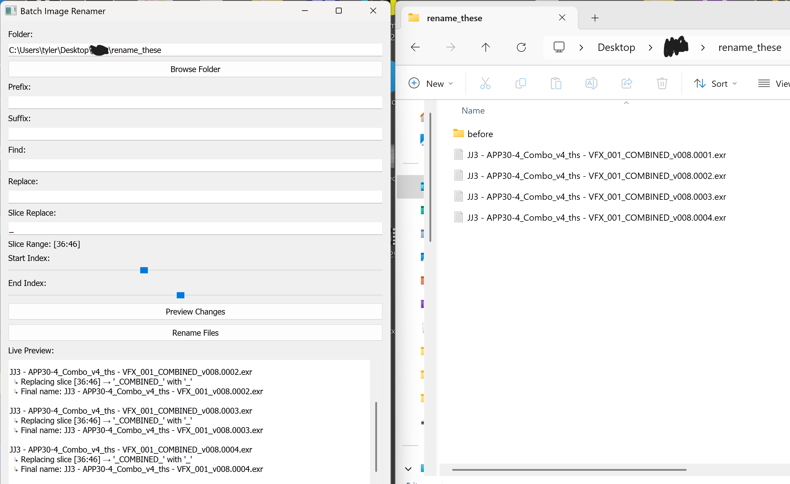

# Batch Rename Tool

## An executable for renaming image sequences with precise control. 

BatchRenamer is a PyQt-based GUI tool for batch renaming image sequences with support for prefix/suffix, find/replace, and positional string slicing with live preview.

Example usage:

